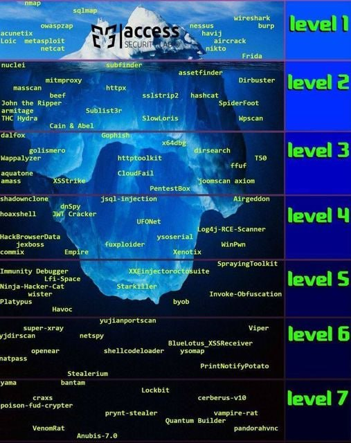

<h1 align="center">Iceberg de Herramientas de Hacking Ético </h1>

  

## Nivel 1

1. **Nmap:**
   - *Función:* Escáner de red.
   - *Uso:* Detecta hosts y servicios en una red.
   - *Codigo:* https://github.com/nmap/nmap

2. **SQLmap:**
   - *Función:* Detectar y explotar vulnerabilidades SQL.
   - *Uso:* Automatiza el proceso de detección y explotación de inyecciones SQL en aplicaciones web.
   - *Codigo:* https://github.com/sqlmapproject/sqlmap

3. **OWASP ZAP (Zed Attack Proxy):**
   - *Función:* Proxy de seguridad utilizado para encontrar vulnerabilidades en aplicaciones web.
   - *Uso:* Escanea aplicaciones web en busca de vulnerabilidades como inyecciones SQL, cross-site scripting (XSS), entre otros.
   - *Codigo:* https://github.com/zaproxy/zaproxy

4. **Acunetix:**
   - *Función:* Escáner de seguridad web.
   - *Uso:* Identifica y corrige vulnerabilidades en aplicaciones web, incluyendo SQL injection y cross-site scripting.
   - *Codigo:* Propietario

5. **LOIC (Low Orbit Ion Cannon):**
   - *Función:* Herramienta de ataque de denegación de servicio (DoS).
   - *Uso:* Permite a los usuarios lanzar ataques de denegación de servicio contra sitios web o servicios específicos.
   - *Codigo:* https://github.com/NewEraCracker/LOIC

6. **Metasploit:**
   - *Función:* Proporciona información sobre vulnerabilidades de seguridad y ayuda en su explotación.
   - *Uso:* Desarrollo, prueba y ejecución de exploits contra sistemas remotos.
   - *Codigo:* https://github.com/rapid7/metasploit-framework

7. **Nessus:**
   - *Función:* Escáner de vulnerabilidades.
   - *Uso:* Identifica y evalúa las vulnerabilidades en sistemas informáticos y redes.
   - *Codigo:* Propietario

8. **Havij:**
   - *Función:* Herramienta de prueba de penetración para inyecciones SQL.
   - *Uso:* Automatiza la detección y explotación de vulnerabilidades de inyección SQL en bases de datos.
   - *Codigo:* Propietario

9. **Aircrack-ng:** 
    - *Función:* Suite de herramientas de seguridad inalámbrica.
    - *Uso:* Se utiliza para monitorear y atacar redes inalámbricas, incluyendo la recuperación de claves WEP y WPA.
    - *Codigo:* https://github.com/aircrack-ng/aircrack-ng

10. **Nikto:**
    - *Función:* Escáner web que realiza pruebas en servidores web en busca de posibles problemas.
    - *Uso:* Identifica vulnerabilidades y configuraciones incorrectas en servidores web.
    - *Codigo:* https://github.com/sullo/nikto

11. **Frida:**
    - *Función:* Marco para pruebas de penetración en aplicaciones móviles.
    - *Uso:* Permite la manipulación dinámica de aplicaciones en tiempo de ejecución, útil para análisis y pruebas de seguridad.
    - *Codigo:* https://github.com/frida/frida

12. **Wireshark:**
    - *Función:* Analizador de protocolos de red.
    - *Uso:* Captura y analiza el tráfico de red, proporcionando detalles sobre los protocolos utilizados y los datos transmitidos.
    - *Codigo:*  https://github.com/wireshark/wireshark

13. **Burp Suite:**
    - *Función:* Conjunto de herramientas de prueba de seguridad para aplicaciones web.
    - *Uso:* Realiza escaneos de seguridad, pruebas de penetración y manipulación de tráfico web para identificar y corregir vulnerabilidades.
    - *Codigo:* Propietario

## Nivel 2

## Nivel 3

## Nivel 4

## Nivel 5

## Nivel 6

## Nivel 7